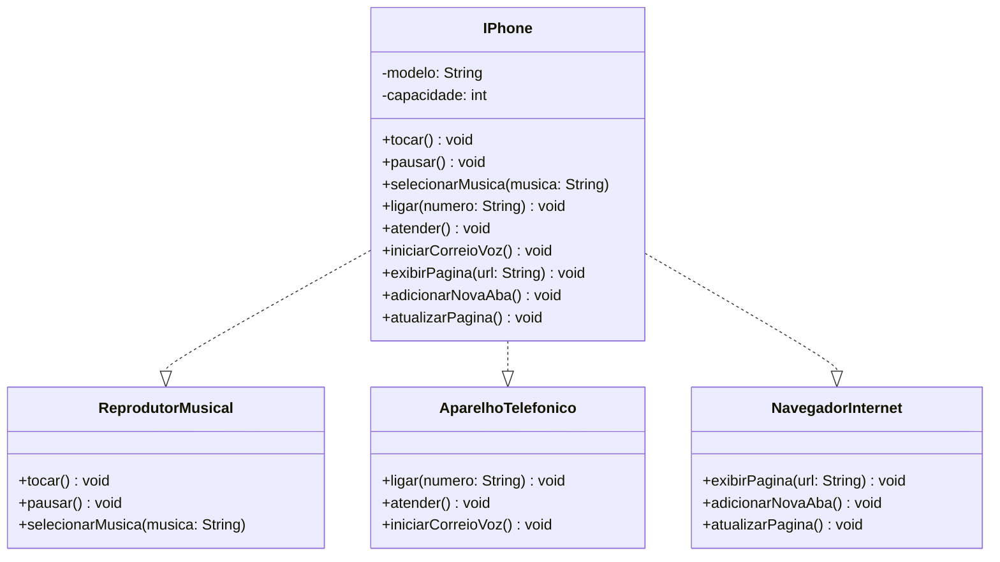

# dio-trilha-java-basico

# Diagrama UML - iPhone

```mermaid
classDiagram
    class ReprodutorMusical {
        +tocar() void
        +pausar() void
        +selecionarMusica(musica: String)
    }
    
    class AparelhoTelefonico {
        +ligar(numero: String) void
        +atender() void
        +iniciarCorreioVoz() void
    }
    
    class NavegadorInternet {
        +exibirPagina(url: String) void
        +adicionarNovaAba() void
        +atualizarPagina() void
    }
    
    class IPhone {
        -modelo: String
        -capacidade: int
        +tocar() void
        +pausar() void
        +selecionarMusica(musica: String)
        +ligar(numero: String) void
        +atender() void
        +iniciarCorreioVoz() void
        +exibirPagina(url: String) void
        +adicionarNovaAba() void
        +atualizarPagina() void
    }
    
    IPhone ..|> ReprodutorMusical
    IPhone ..|> AparelhoTelefonico
    IPhone ..|> NavegadorInternet
```
